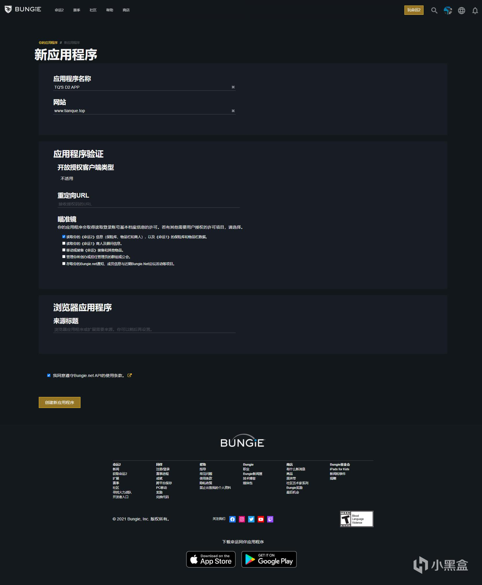

翻译这篇教程的起因是看到近日社区中对于Destiny2 Bot有一定讨论，由社区成员@藤原包子铺 牵头成立讨论组。

讨论组核心目标如下:

1. 发布D2 bot开发教程

2. 使用python封装Bungie API以方便使用

3. 发布开源D2 bot

同时欢迎有想法、想要了解或学习bot开发的小伙伴加入讨论群：924026546

那么，在发布bot教程之前，由于bot中几乎所有D2功能都使用到了Bungie官方API，在学习开发bot之前有必要学会如何使用Bungie API，我在接触API之初也是凭借这篇教程入门，索性抛砖引玉，希望大家能学到自己的一份知识，也希望有更多感兴趣的小伙伴加入讨论组一起学习。

(我淦，这前端动不动就吞内容，写一点发一点得了)

本文主体内容译自 [Destiny2-API-Info Wiki](https://github.com/vpzed/Destiny2-API-Info)

如果大家有能力可以去点个star最好不过，同时感谢作者进行分享。

关于授权：已向作者提出申请，后续根据作者回复进行改动或删除

关于演示：为保证数据时效，文中所有API演示替换为译者账户数据

关于这个能做什么

我们所熟悉的DIM以及Light.gg都是以Bungie API为基础进行开发，也就是DIM所能做到的，在适当学习后我们也可以做到。

## 0x00 序言

欢迎使用Destiny2-API-Info Wiki

我将在这里存储有关Destiny 2 API的信息，以及其他Destiny 2开发人员提交的文章。

如果您想发表文章，只需创建Markdown Gist并将链接发送给我。我将在文章标题中将其作为作者添加到您的GitHub用户名中。

如果您是在寻找Bungie API项目，则这里是[Bungie API官方页面](https://github.com/Bungie-net/api)。

## 0x01 API简介-第1部分-事前准备
### 介绍
本教程系列将介绍有关如何使用Destiny 2 API的一些初学者信息。本节将介绍使用API测试公共API端点请求和响应所需的初始设置。
### Bungie.net API密钥
本文假定您已经有一个Bungie.net帐户。如果您还没有，那么可以在这里创建一个https://www.bungie.net/zh-chs/User/JoinUp

登录到Bungie.net帐户后，您可以在以下位置访问“应用程序”页面以请求API密钥：https://www.bungie.net/zh-chs/Application

选择创建新应用程序按钮以进入新应用程序界面。您可以创建具有不同配置的多个应用程序。对于此初始介绍，我们将不使用OAuth身份验证。该主题将在以后的文章中介绍。

在“新应用程序”界面中，输入您的应用程序名称和网站。在“应用程序身份验证”>“ 开放授权客户端类型”中，选择“不适用”。将“重定向URL”保留为空白。在瞄准镜(实际应为作用域，bungie官网机翻)下，选择“读取你的《命运2》信息（保险库、物品栏和商人）。在“基于浏览器的应用程序”>“来源标题”下，输入*选中该框以同意使用条款，然后单击“创建新应用程序”按钮（也就是来源标题留空哦）。

